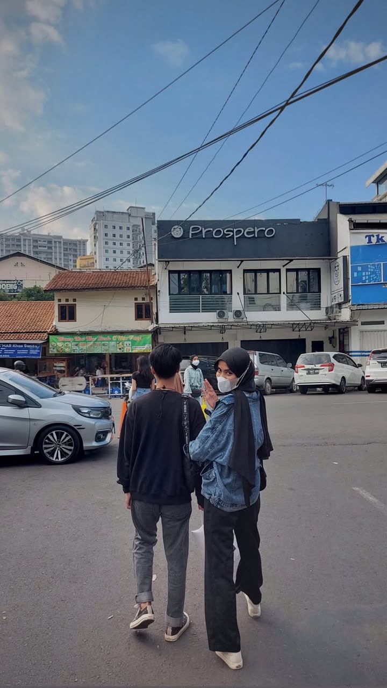
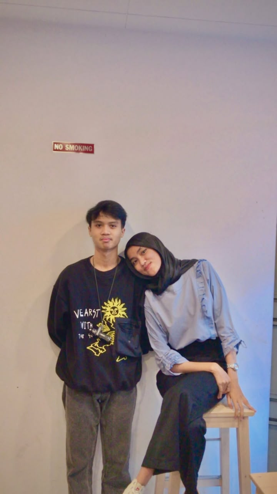
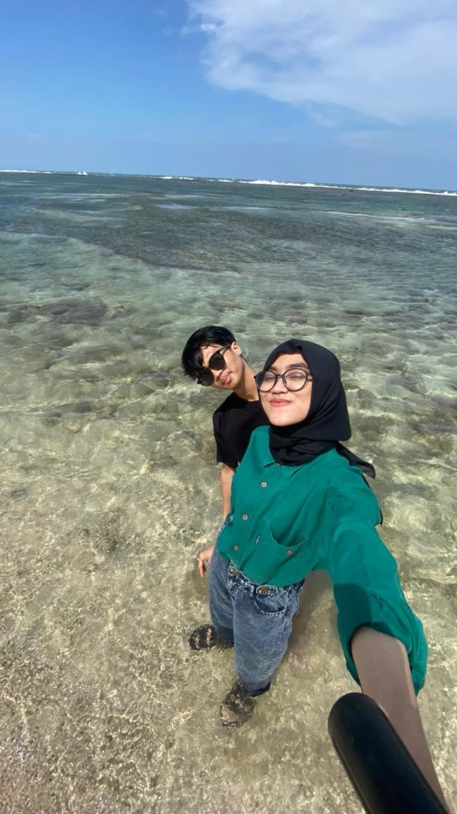
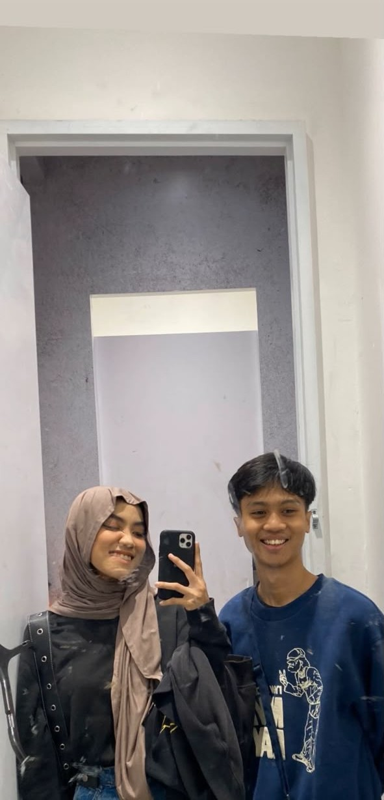
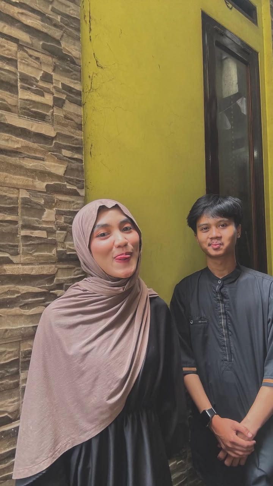
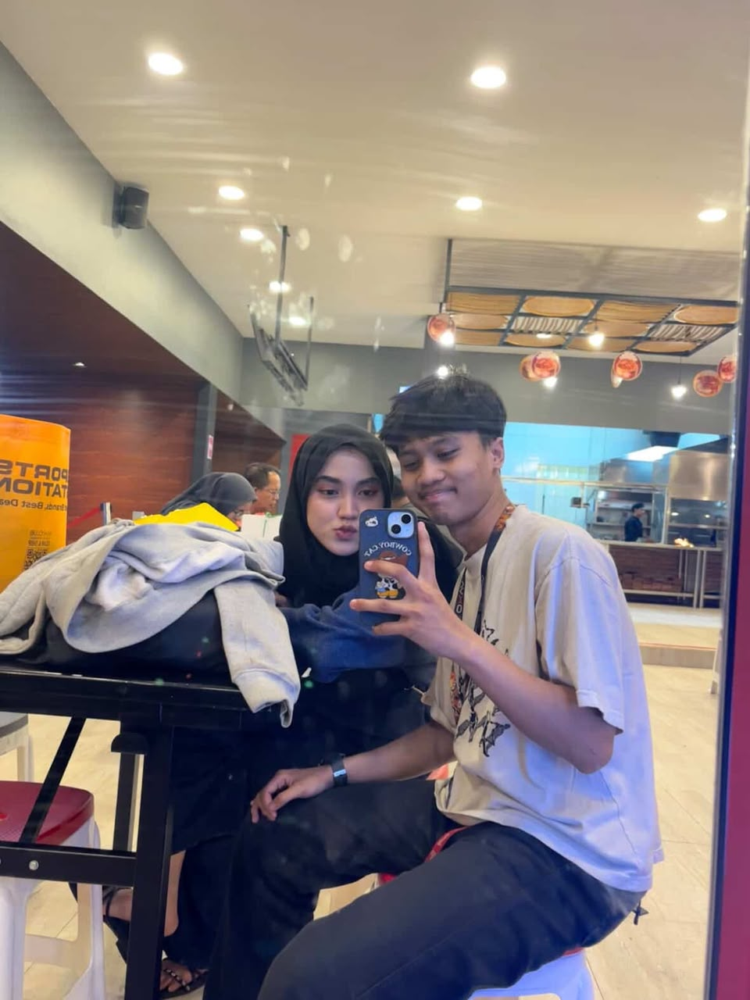

<head>
    <link rel="stylesheet" href="https://unpkg.com/aos@2.3.4/dist/aos.css">
<link rel="stylesheet" href="edit1.css"></head>

    
Kepada Yth.

    <h2 id="guestName">
        Tamu Undangan
    </h2>

    <small>Mohon maaf apabila ada kesalahan penulisan nama.</small>

<section class="hero">
    

        <h4>The Wedding Of</h4>
        <h1>Jidan dan Wulan</h1>
        
12 Desember 2026

        <a href="#mempelai" class="btn" onclick="openInvitation()">
    Buka Undangan
</a>
    

</section>

<section id="mempelai" class="section">

    <h2 data-aos="fade-up">Assalamu'alaikum WR. WB</h2>

    

        Dengan memohon rahmat Allah SWT kami mengundang
        Bapak/Ibu/Saudara/i untuk hadir pada acara
        pernikahan kami.
    

    

        

            
            <h3>Zidhan Rhamadhan</h3>
            
Putra Bapak Wawan Setiawan dan Ibu Dini Hernawati

        

        

             ❤
        

        

            
            <h3>Wulanjani Santoso</h3>
            
Putri Bapak Widodo dan Ibu Rukmini

        

    

</section>
<section class="love-story" id="story">

    <h2 data-aos="fade-up">Kisah Cinta Kami</h2>
    

        "Tidak ada yang kebetulan di dunia ini. Semua telah tersusun rapi oleh Sang Pencipta."
    

    

        

            
2020

            

                <h3>Pertama Bertemu</h3>
                

                    Kami dipertemukan untuk pertama kalinya dalam sebuah acara.
                    Dari pertemuan sederhana itulah kisah kami dimulai.
                
 
            

        

        

            
2021

            

                <h3>Mulai Menjalin Hubungan</h3>
                

                    Setelah saling mengenal lebih dekat,
                    kami memutuskan untuk berjalan bersama
                    dalam suka maupun duka.
                

            

        

        

            
2026

            

                <h3>Lamaran</h3>
                

                    Dengan restu kedua keluarga,
                    kami melangkah ke tahap yang lebih serius
                    melalui acara lamaran.
                

            

        

        

            
2027

            

                <h3>Hari Bahagia</h3>
                

                    InsyaAllah kami akan mengikat janji suci
                    dalam pernikahan dan memulai perjalanan hidup baru.
                

            

        

    

</section>
<section class="gallery">

    <h2 data-aos="fade-up">Galeri Foto</h2>

    

        
        
        
        
        
        

    

</section>

<!-- LIGHTBOX -->

    &times;

    

<section class="section">

    <h2 data-aos="zoom-in">
        Akad Nikah
    </h2>

    

        Sabtu, 12 Desember 2026
         
        09.00 WIB
    

</section>

<section class="section">

    <h2 data-aos="zoom-in">
        Resepsi
    </h2>

    

        11.00 WIB
    

<section class="section">

    <h2 data-aos="fade-up">
        Lokasi
    </h2>

    <a href="https://maps.app.goo.gl/YezKFnh4LYkeBRxS7"
       target="_blank"
       class="btn"
       data-aos="zoom-in">
        Google Maps
    </a>
</section>
<section class="gift" id="gift">

    <h2 data-aos="fade-up">🎁 Amplop Digital</h2>

    

        Doa restu Anda merupakan hadiah terindah bagi kami.
        Namun jika ingin memberikan tanda kasih,
        dapat melalui rekening berikut.
    

    

        <!-- BCA -->
        

            <h3>BCA</h3>

            <h4>7772245656</h4>

            
a.n. Zidhan Rhamadhan

            <button onclick="copyText('7772245656')">
                Salin Nomor Rekening
            </button>

        

        <!-- Aladin -->
        

            <h3>Aladin</h3>

            <h4>50287046454</h4>

            
a.n. Zidhan Rhamadhan

            <button onclick="copyText('50287046454')">
                Salin Nomor Rekening
            </button>

        

    

    <!-- QRIS -->

    

        

        
Scan QRIS untuk memberikan hadiah.

    

</section>

<section class="countdown-section">
    <h2>Menuju Hari Bahagia</h2>

    

        

            00
            <small>Hari</small>
        

        

            00
            <small>Jam</small>
        

        

            00
            <small>Menit</small>
        

        

            00
            <small>Detik</small>
        

    

</section>

<audio id="bgMusic" loop>
    <source src="Assets/Music/audio weeding.mp3" type="audio/mpeg">
</audio>

</body>

